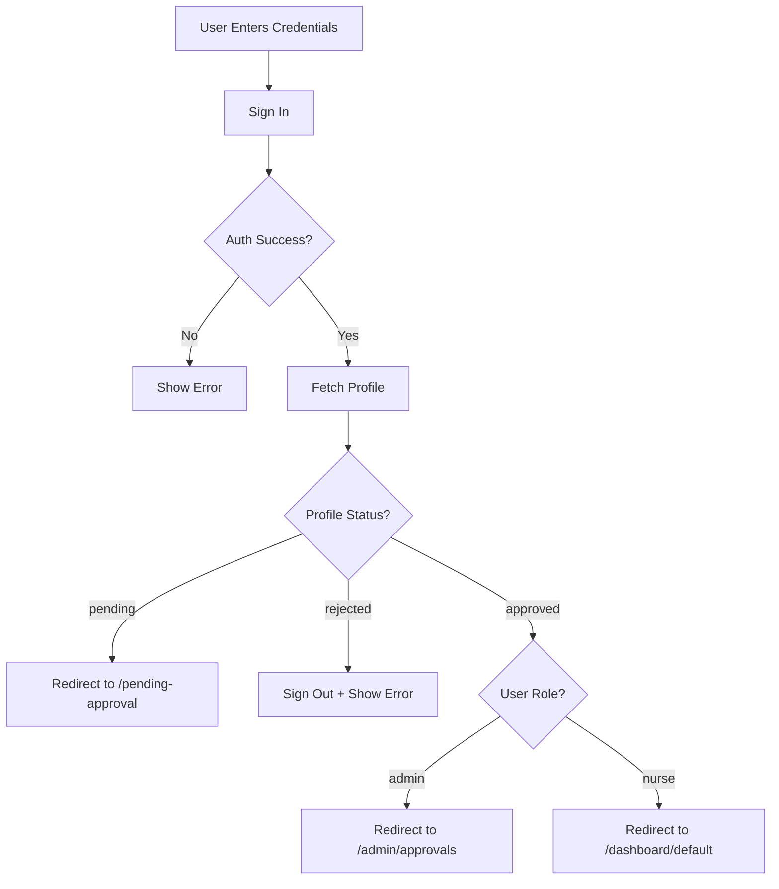

# Hybrid Auth Frontend Implementation

## Overview

This document describes the hybrid authentication frontend implementation for the NurseNote application. The system uses Supabase Auth for authentication with role-based access control (RBAC) and profile status management.

## Architecture

### Authentication Flow

1. **Login**: Users can sign in via:
   - Email/Password
   - Google OAuth
   - Microsoft (Azure) OAuth

2. **Profile Check**: After authentication, the system checks the user's profile:
   - `status = 'pending'` → Redirect to `/pending-approval`
   - `status = 'rejected'` → Sign out and show error
   - `status = 'approved'` → Allow access based on role

3. **Role-Based Access**:
   - `role = 'admin'` → Access to admin pages + all nurse pages
   - `role = 'nurse'` → Access only to nurse pages

## Components

### Hooks

#### `useAuthProfile`
Location: `src/hooks/useAuthProfile.js`

Fetches and manages user authentication state and profile data.

**Returns:**
```javascript
{
  session,      // Supabase session object
  user,         // Supabase user object
  profile,      // User profile from profiles table
  loading,      // Loading state
  error,        // Error object
  refetchProfile // Function to manually refetch profile
}
```

### Route Guards

#### `AuthGuard`
Location: `src/components/auth/AuthGuard.jsx`

Protects routes requiring authentication and approval.

**Behavior:**
- No session → Redirect to `/login`
- Session + status != 'approved' → Redirect to `/pending-approval`
- Session + status == 'approved' → Render children

#### `AdminGuard`
Location: `src/components/auth/AdminGuard.jsx`

Protects admin-only routes.

**Behavior:**
- No session → Redirect to `/login`
- Session + (status != 'approved' OR role != 'admin') → Redirect to `/dashboard/default`
- Session + status == 'approved' + role == 'admin' → Render children

### Pages

#### `/pending-approval`
Location: `src/app/(auth)/pending-approval/page.jsx`

Shows a waiting screen for users pending approval.

**Features:**
- Displays user email and status
- Shows informational message
- Logout button

#### `/admin/approvals`
Location: `src/app/(dashboard)/admin/approvals/page.jsx`

Admin page to approve or reject pending users.

**Features:**
- Lists all pending users
- Approve/Reject buttons
- Calls Edge Function `admin-approve-user`
- Toast notifications

#### `/admin/users`
Location: `src/app/(dashboard)/admin/users/page.jsx`

Admin page to manage all users.

**Features:**
- Search by name/email
- Filter by status and role
- Change user status
- Change user role
- Inline editing

### Error Handling

#### `RLSErrorBoundary`
Location: `src/components/auth/RLSErrorBoundary.jsx`

Catches RLS permission errors and shows friendly UI.

#### Error Utilities
Location: `src/lib/errorHandler.js`

Provides utility functions for handling Supabase errors:
- `isRLSError(error)` - Detects RLS permission errors
- `handleSupabaseError(error)` - Returns standardized error object
- `withErrorHandling(fn, onError)` - Wraps async functions with error handling

## Types

Location: `src/types/auth.ts`

```typescript
export type Role = 'admin' | 'nurse';
export type Status = 'pending' | 'approved' | 'rejected';

export interface Profile {
  id: string;
  email: string;
  role: Role;
  status: Status;
  name: string | null;
  birthday: string | null;
  gender: string | null;
  address: string | null;
  created_at: string;
}
```

## Menu System

### Admin Menu
Location: `src/menu-items/admin.jsx`

Defines admin-only menu items with `adminOnly: true` flag.

### Menu Filtering
Location: `src/layout/Dashboard/Drawer/DrawerContent/Navigation/index.jsx`

Filters menu items based on user role:
- Admin users see all menu items
- Nurse users don't see items marked with `adminOnly: true`

## Login Flow



## OAuth Callback

Location: `src/app/(auth)/auth/callback/page.jsx`

Handles OAuth redirects and performs the same profile checks as email/password login.

**OAuth Providers:**
- Google: `provider: 'google'`
- Microsoft: `provider: 'azure'`

**Redirect URL:** `${window.location.origin}/auth/callback`

## Usage Examples

### Protecting a Page

```jsx
import AuthGuard from '@/components/auth/AuthGuard';

export default function MyPage() {
  return (
    <AuthGuard>
      <div>Protected Content</div>
    </AuthGuard>
  );
}
```

### Protecting an Admin Page

```jsx
import AdminGuard from '@/components/auth/AdminGuard';

export default function AdminPage() {
  return (
    <AdminGuard>
      <div>Admin Only Content</div>
    </AdminGuard>
  );
}
```

### Using Profile Data

```jsx
import { useAuthProfile } from '@/hooks/useAuthProfile';

export default function MyComponent() {
  const { profile, loading } = useAuthProfile();

  if (loading) return <div>Loading...</div>;
  
  return (
    <div>
      <p>Welcome, {profile?.name}</p>
      <p>Role: {profile?.role}</p>
      <p>Status: {profile?.status}</p>
    </div>
  );
}
```

### Checking User Role

```jsx
import { useAuthProfile } from '@/hooks/useAuthProfile';

export default function MyComponent() {
  const { profile } = useAuthProfile();
  
  return (
    <div>
      {profile?.role === 'admin' && (
        <button>Admin Action</button>
      )}
    </div>
  );
}
```

## Edge Functions

The frontend calls the following Edge Functions:

### `admin-approve-user`

**Purpose:** Approve or reject user accounts

**Request Body:**
```json
{
  "userId": "uuid",
  "status": "approved" | "rejected"
}
```

**Usage in Frontend:**
```javascript
const { error } = await supabase.functions.invoke('admin-approve-user', {
  body: { userId, status: 'approved' }
});
```

## Database Schema

The frontend expects a `profiles` table with:

```sql
CREATE TABLE public.profiles (
  id UUID PRIMARY KEY REFERENCES auth.users(id),
  email TEXT NOT NULL,
  role TEXT NOT NULL CHECK (role IN ('admin', 'nurse')),
  status TEXT NOT NULL CHECK (status IN ('pending', 'approved', 'rejected')),
  name TEXT,
  birthday DATE,
  gender TEXT,
  address TEXT,
  created_at TIMESTAMPTZ DEFAULT now()
);
```

## RLS Policies

The system relies on Row Level Security (RLS) policies:

1. **Pending users**: Can only read their own profile
2. **Approved nurses**: Can access nurse-specific data
3. **Approved admins**: Can access all data including user management
4. **Rejected users**: No access (will be caught by guards)

## Security Considerations

1. **Client-Side Guards**: All route guards are client-side. For true security, backend RLS policies must be properly configured.

2. **Edge Functions**: Admin actions (approve/reject) should validate permissions in the Edge Function, not just rely on frontend guards.

3. **API Keys**: The frontend uses the Supabase anon key. RLS policies protect sensitive data.

4. **OAuth Scopes**: Microsoft OAuth requests 'email' scope to get user email.

## Styling

The implementation uses:
- Tailwind CSS for styling
- Hospital/medical theme with clean, professional design
- Japanese language for all UI text
- Consistent color scheme (blue primary, status colors)

## Future Enhancements

1. Email notifications when user is approved/rejected
2. Profile editing page for users
3. Audit log for admin actions
4. Bulk approve/reject
5. User search and advanced filtering
6. Export user list to CSV

## Testing Checklist

- [ ] Email/password login works
- [ ] Google OAuth login works
- [ ] Microsoft OAuth login works
- [ ] Pending users redirected to pending page
- [ ] Rejected users cannot log in
- [ ] Approved nurses can access dashboard
- [ ] Approved nurses cannot access admin pages
- [ ] Approved admins can access admin pages
- [ ] Admin can approve users
- [ ] Admin can reject users
- [ ] Menu filters admin items for nurses
- [ ] Profile shows correct role badge
- [ ] Logout works correctly
- [ ] RLS errors show friendly message

